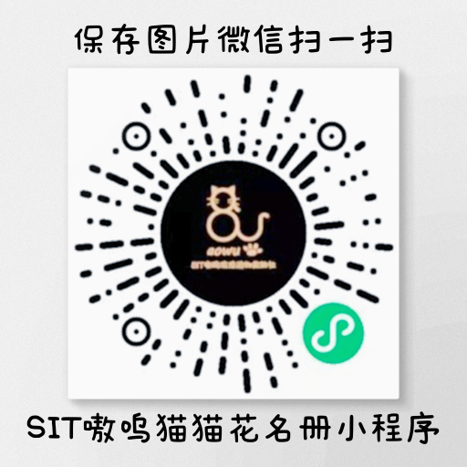

# 猫猫百科

SIT嗷呜猫猫花名册

## 校内猫咪一览

欢迎使用**SIT嗷呜猫猫花名册**微信小程序，你可以扫描下方的二维码进入小程序，以了解校园猫咪情况。

更多有关我校猫咪领养绝育的资讯可搜索微信公众号**SIT嗷呜流浪动物救助社**查看。欢迎你在公众号留言补充信息，或向我们反馈意。谢谢！

## 关于我们

上海应用技术大学**嗷呜流浪动物救助社团**（简称**嗷呜**）成立于 2020 年，是同学们自发创立的非营利性组织。*（由于学校对社团的理解不同，未在学校以社团身份备案）*

自组织成立以来，我们一直致力于提供定点喂养、送养、绝育等方式，改善校内生态环境及提高校内流浪猫生活质量。可搜索 QQ 群 631357316 加入我们。

制作SIT嗷呜猫猫花名册的初心是希望大家可以了解散落在校园各处的猫猫，它们也像人一样有血有肉有各自的性格和情感。
与此同时，也呼吁大家加入嗷呜，一起营造尊重生命、爱护流浪动物、良好的人与动物的相处氛围。

在此特别感谢**北京大学学生流浪猫关爱协会**以及小程序**燕园猫手册**的制作同学为我们提供的技术指导和帮助，愿两校友谊长存!

## 免责声明

流浪动物虽不会主动攻击人，但嗷呜也**不提倡**同学抚摸校内流浪动物，若您在校内因主动接触流浪动物而造成了损伤，嗷呜对此概不负责。

## 屏幕截图

