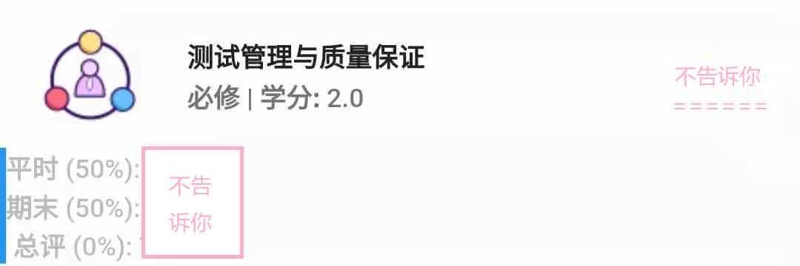
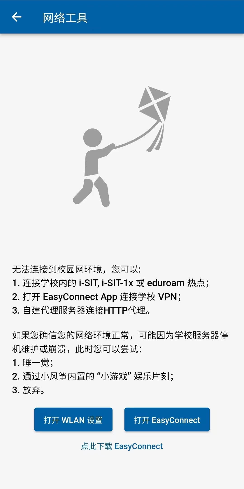

# 功能介绍

## 天气

打开 App, 天气便直接展现在屏幕上了。天气数据约 10 分钟从气象平台上拉取（最大不超过 20 分钟），你可以在设置中切换你所在的校区。 天气数据有精度限制。出于成本考虑（1 平方公里的高精度数据每年需要 600
元运营成本），小风筝上获取到的天气数据是以区为单位。当前支持奉贤区和徐汇区。

## 上报自动登录

经常要打开 QQ、微信，找到二维码长按识别，再进行每日体温上报，是不是很麻烦？即使是学校官方 App，也需要在上报页面二次输入密码。 使用小风筝没有这个烦恼！你可以在首页点击 “上报” 直接进入页面，再也不用那么麻烦。

## 桌面快捷按钮

Q: 那不是还要打开 App 嘛，怎么办？

啊这个我们~~不能说~~没办法了，不过有一个折中的方案。Android 和 iOS 上，你可以长按小风筝的图标进入 **“课程表”** 和 **”体温上报“** 页面，减轻你的烦恼。

## 算绩点

现有的 App 延续的小程序中的绩点计算，可以很方便地查询绩点。

你以为这就完了？ **不！** 小程序中绩点的计算方式比较死板，在出现选修课、体育课的时所计算的数值会和实际奖学金评定的绩点不一致。 在这个版本中，我们添加了 **选择课程计算绩点**
功能，你可以长按课程选择，程序会自动计算你所选科目的绩点。

## 评教

想在小风筝上查成绩，但是得先上电脑评教；为了评教，还得连上 Sangfor EasyConnect 操作一番太麻烦？ 我也觉得，所以我们把它搬到手机上来了！当你的课程出分后，可以直接在小风筝上进入评教页面，省去了好多烦恼。

> 注意，由于学校教务系统的问题，一门课可能会拆成两个逻辑上的班级并要求评教。通常情况下，只需要评教一个即可查看成绩。
>
> 在小风筝中，如果出现这种情况，你可以在评教完一个页面后，再点击右下角的 “→” 箭头评教下一门 “虚拟课程”，也可以返回并刷新，直接查看成绩。
> 不过，这可能导致你出现在 “未评教” 名单里。

## 成绩详情

点击课程即可查看成绩详情。话不多说，来看张图。

## "应网办" 极速版

一直觉得这个功能秉持着 “让数据少跑腿，让群众既跑腿又跑路” 的态度。平台上功能十分繁杂，要找一个功能或许还要委屈自己的手指头，动用大杀器 “搜索框”！ 申请完后还要自己亲自跑一趟，否则不知道什么时候才会通过。

现在小风筝上上线 “应网办” 极速版啦！直接进入常用功能，不用再面对那个满是图标的网页了。我们还精选了 **“常用功能”**， 你可以在右上角上设置是否对列表进行过滤。

## 常用电话

我们在学校常用电话表外，还手动收集了个别学院教务和学校门诊部的电话，供大家用。大家可以去体验一下。

## 小游戏

一些朋友提议上线一些别的游戏，我们在认真考虑，不过希望选中的游戏界面符合整体设计、能离线使用。排名系统已经上线。

2048 yyds，你最高拿过多少分呢？

## 首页

不知道你注意过没有，首页可以下拉刷新！下拉后，小风筝会自动更新大部分模块在本地的缓存。

首页的 logo 可以点击，一些不常用的内容都在这里，欢迎大家在 “反馈” 页找我们玩呀！（这是我们的秘密）

## HTTP 代理

> 该功能限高级用户使用

如果你厌倦了每次打开小风筝都需要使用校园网或 Sangfor EasyConnect，这儿也有一个解决方案。

你可以自建一个 **内网穿透** 服务和 **正向代理** 服务，将内网穿透的流量转发到正向代理即可。 理论上来说，小风筝支持 HTTP(S)/SOCKS5 代理，但是目前仅支持 HTTP 代理。

## 网络工具

在网络异常的时候，你可以根据提示点击 “检查网络” 按钮，或在设置中打开 “网络工具” 检查。

## Wiki

谦虚一点，把本 Wiki 放在后面。 我们致力于打造最全的上应大生存指南，涵盖学习、生活、娱乐等方方面面，再也不用到处问人了。 欢迎各位多多捧场！（脑补一张 `陈佩斯.jpg`）

我们的首页是：[https://cdn.kite.sunnysab.cn/wiki/](https://cdn.kite.sunnysab.cn/wiki/)
