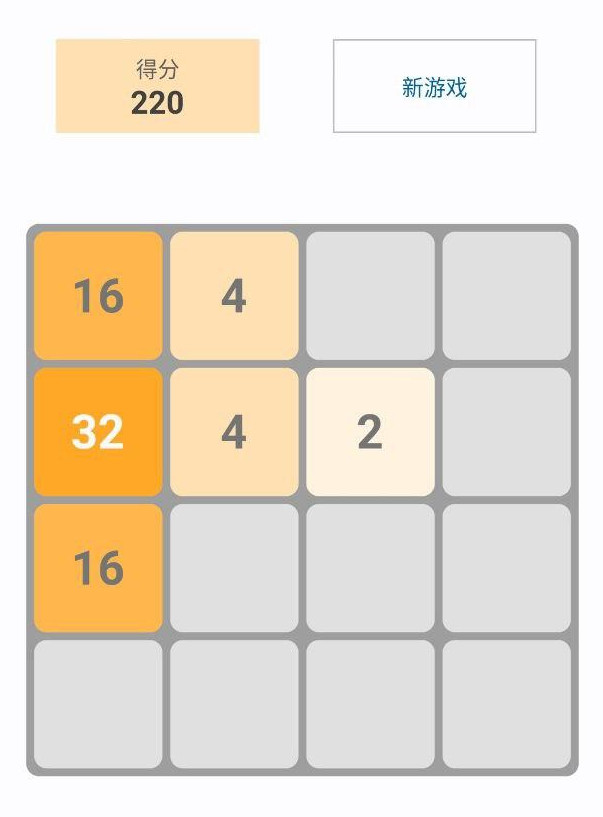

# “小游戏” 指南

## 2048

2048 游戏共有 16 个格子，初始方块中的数字为 2 或 4。

1. 手指向一个方向滑动，所有格子会向那个方向运动。
2. 相同数字的两个格子，相撞时数字会相加。
3. 每次滑动时，空白处会随机刷新出一个数字的格子。
4. 当界面不可运动时（即，界面全部被数字填满时），游戏结束并记录成绩。

## Wordle

Wordle 是一个猜单词的游戏，所选单词均只有 5 个字母。

1. 你有 6 次尝试的机会。
2. 你每次的输入都必须是一个存在的单词。
3. 当某一位正确时，该输入框会变成绿色。
4. 当某一位的字母存在于答案中、但位置错误时，该输入框会变成橙色。
5. 若输入的字母不存在于答案中，该输入框颜色不变。

